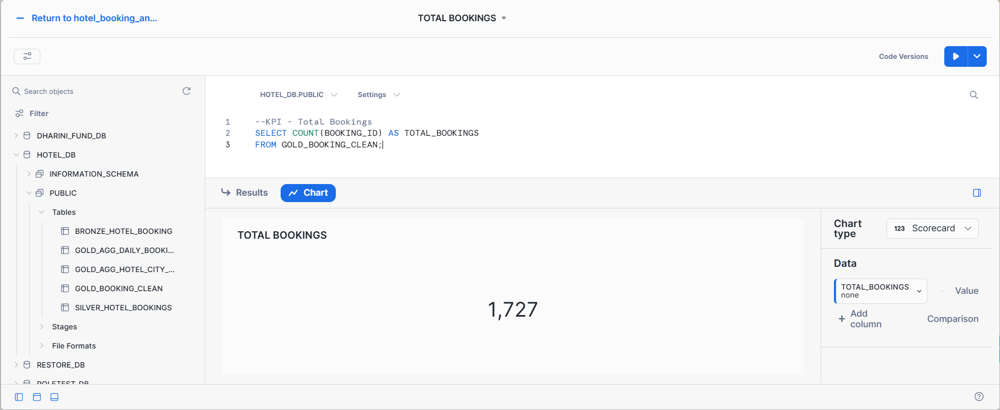
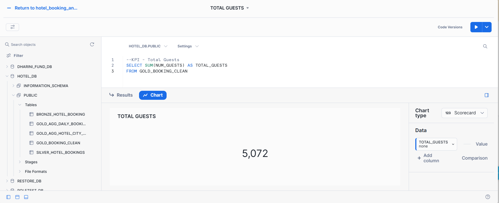
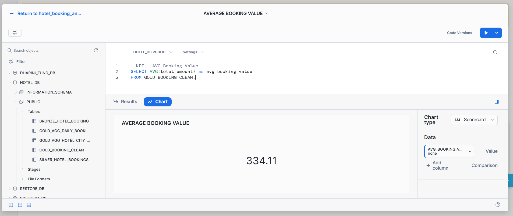
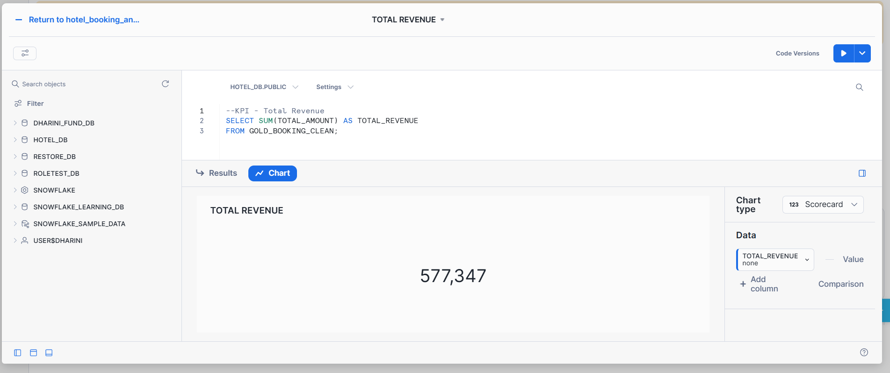
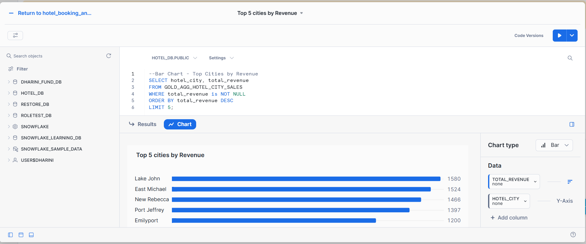
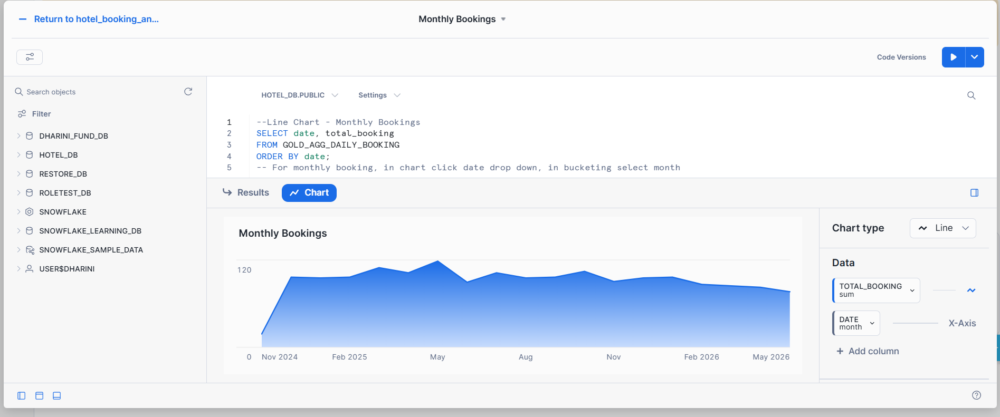
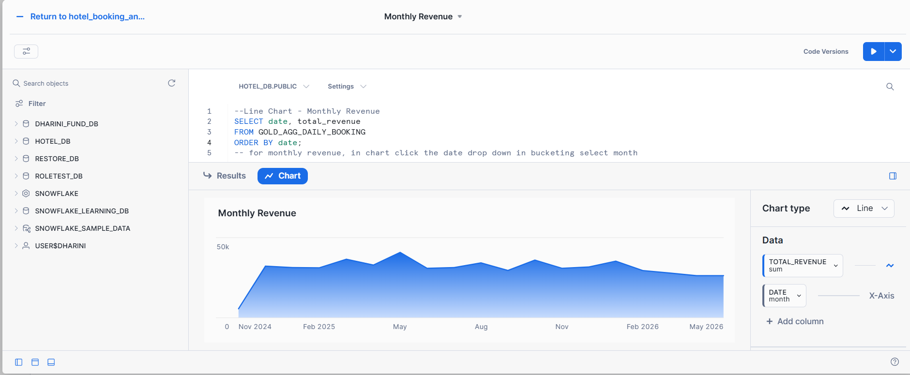
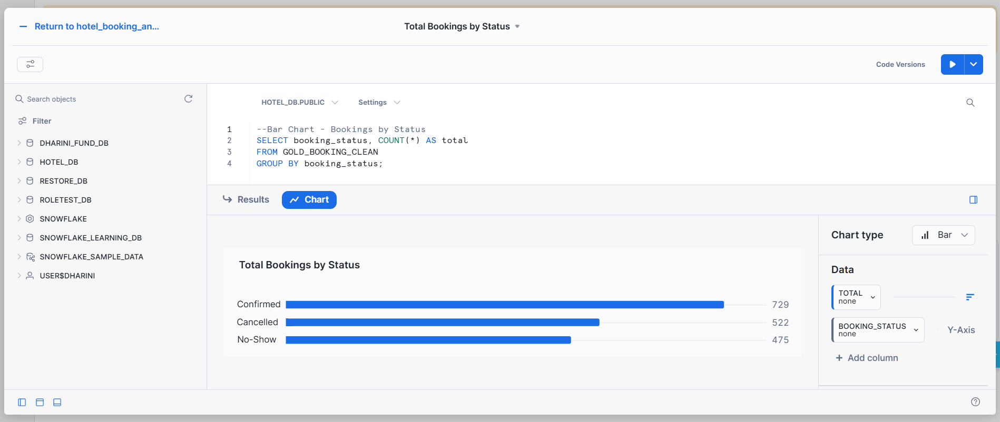

## 📊 KPIs & Business Insights

This section presents key performance indicators (KPIs) and visual insights derived from the Gold Layer.

---

### 📌 1. Total Bookings

Total number of bookings recorded in the dataset.

---

### 👥 2. Total Guests

Total number of guests across all bookings.

---

### 💰 3. Average Booking Value

Average revenue generated per booking.

---

### 💵 4. Total Revenue

Total revenue generated from all bookings.

---

### 🌍 5. Top 5 Cities by Revenue

Shows the highest revenue-generating cities.

---

### 📈 6. Monthly Bookings Trend

Trend of bookings over time (monthly aggregation).

---

### 📈 7. Monthly Revenue Trend

Trend of revenue over time (monthly aggregation).

---

### 📊 8. Bookings by Status

Distribution of bookings based on status:

* Confirmed
* Cancelled
* No-Show

---

### 🏨 9. Bookings by Room Type

Distribution of bookings across room types.

---

## ✅ Summary of Insights

* Overall booking performance is tracked using KPIs
* Revenue trends help in forecasting
* City-level analysis supports business decisions
* Booking patterns highlight customer behavior

---

