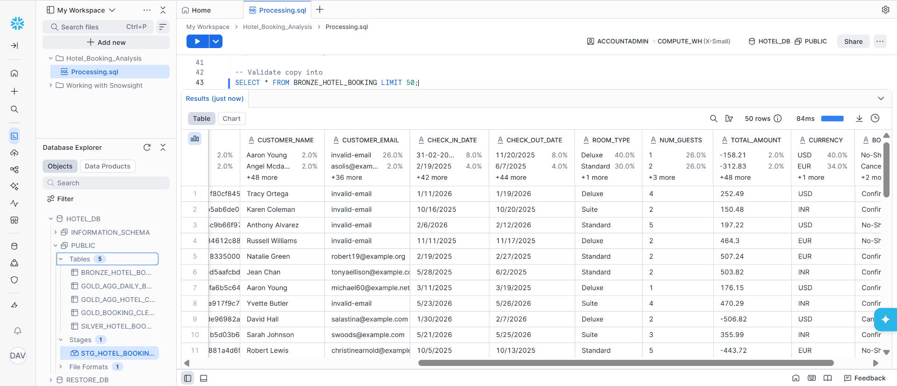
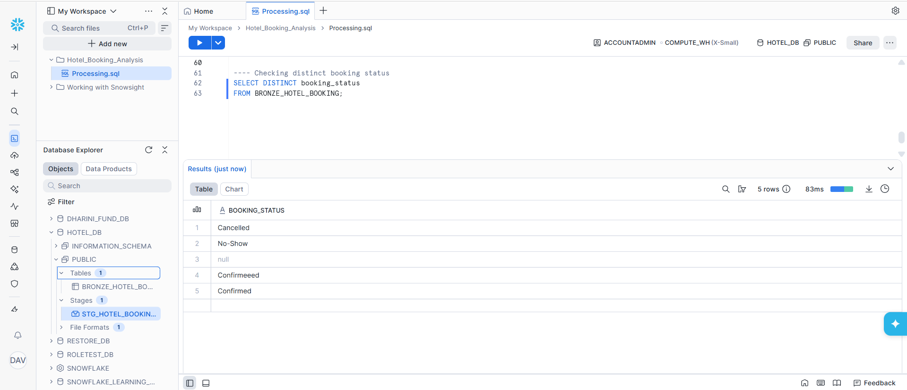
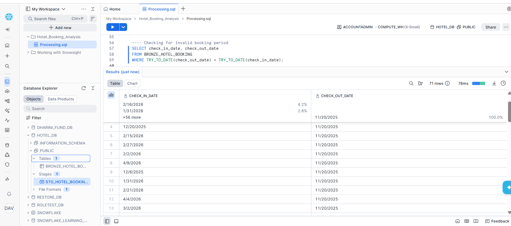
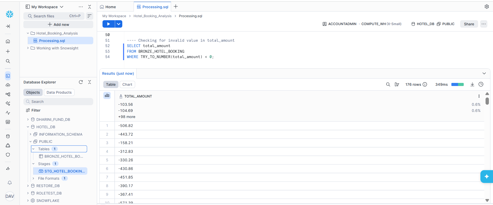
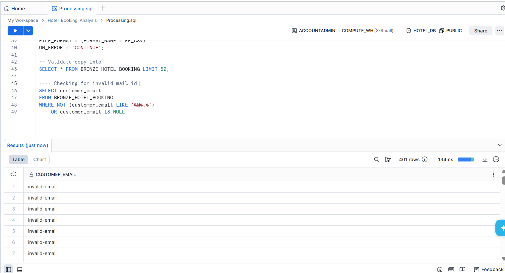
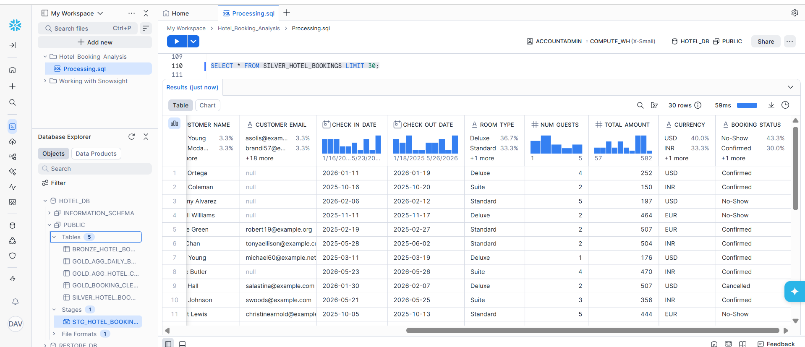
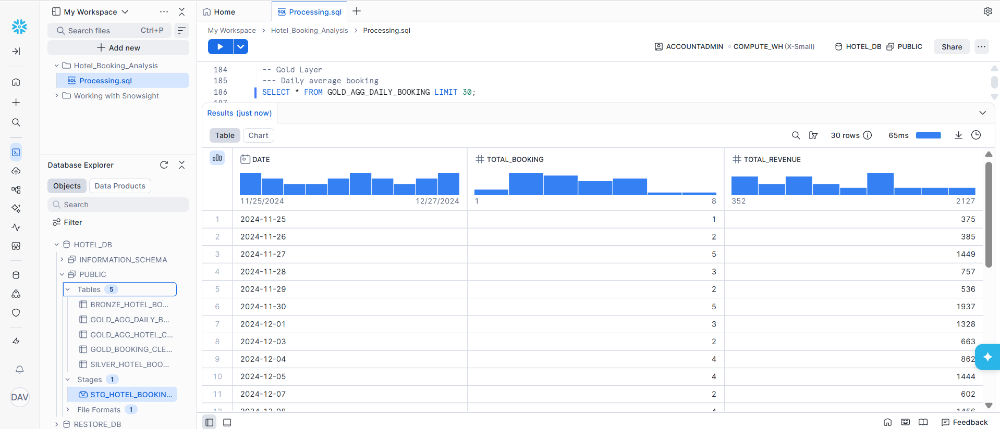
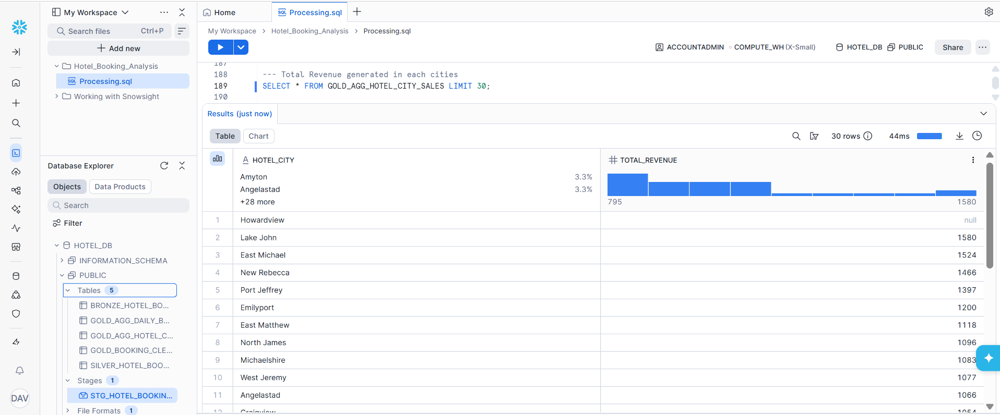
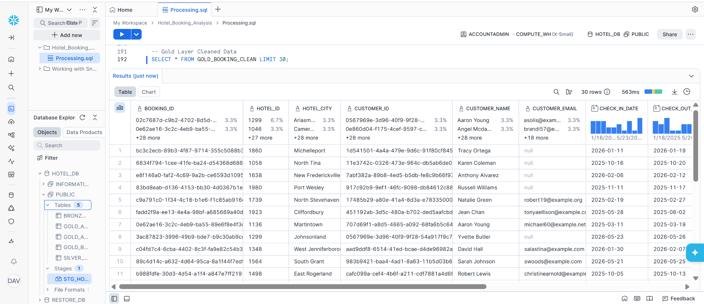

# 📸 Snowflake Data Validation & Processing Screenshots

---

## 📊 1. Sample Data Validation (Bronze Layer)

This shows a preview of raw data after ingestion.

---

## 🔍 2. Checking Invalid Booking Status

This query identifies inconsistent booking status values such as misspellings.

---

## 📅 3. Checking Invalid Booking Dates

This query finds records where check-out date is earlier than check-in date.

---

## 💰 4. Checking Negative Total Amount

This query identifies records with negative revenue values.

---

## 📧 5. Checking Invalid Email IDs

This query detects invalid or missing email addresses.

---

## ✅ Summary

The above validations ensure:

* Clean and consistent data
* Accurate date relationships
* Valid customer information
* Reliable financial metrics

These steps are essential before moving data to the Silver layer.

## 🥈 Silver Layer – Cleaned Data

This table represents the **cleaned and transformed data** after applying validation rules such as:

* Date corrections
* Email validation
* Removal of invalid records
* Standardization of text fields

This layer ensures data is structured and ready for analysis.

---

## 🥇 Gold Layer – Aggregated & Business Data

This layer contains **final, analytics-ready data** used for reporting and decision-making.

---

### 📊 1. Daily Bookings & Revenue

This table shows daily aggregation of:

* Total bookings
* Total revenue

Useful for identifying trends over time.

---

### 🌍 2. Revenue by Hotel City

This table shows total revenue generated in each city.

Useful for:

* Identifying top-performing cities
* Business expansion decisions

---

### 📋 3. Final Clean Dataset

This is the fully cleaned and structured dataset used for analysis.

* Contains validated data
* Ready for dashboard and KPI calculations

---

## ✅ Summary of Gold Layer

* Provides business-level insights
* Aggregated and optimized for reporting
* Used for dashboards and analytics

---

